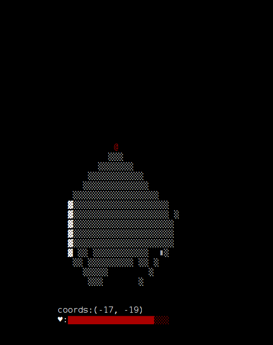

# asyncio_text_game
An attempt to make a real-time rogue-adjacent game using asyncio.

Because different terminals use different color schemes, first run color_setup.py (python color_setup.py) to manually create a color profile by following the onscreen instructions.

Start game by running "python async_game.py" inside the cloned directory.

WASD to move, IJKL to look. x to examine.

Press ? for help.

See handle_input function for full list of testing commands.

See map_init for layout of rooms and misc. world features.

Python 3 only.

