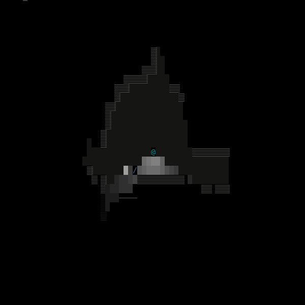

# asyncio_text_game
An on again, off again three-years-long attempt to make a real-time rogue-adjacent game using asyncio.

Mostly it's been an excuse to do a small daily commit but I'm pretty happy about where it's gotten to.

Start game by running "python async_game.py" inside the cloned directory.

Press ? for keybindings.

WASD to move, IJKL to look.
X enters look mode.
Backspace to exit (broken right now).

See handle_input function for full list of testing commands.

See map_init for layout of rooms and world generation.

